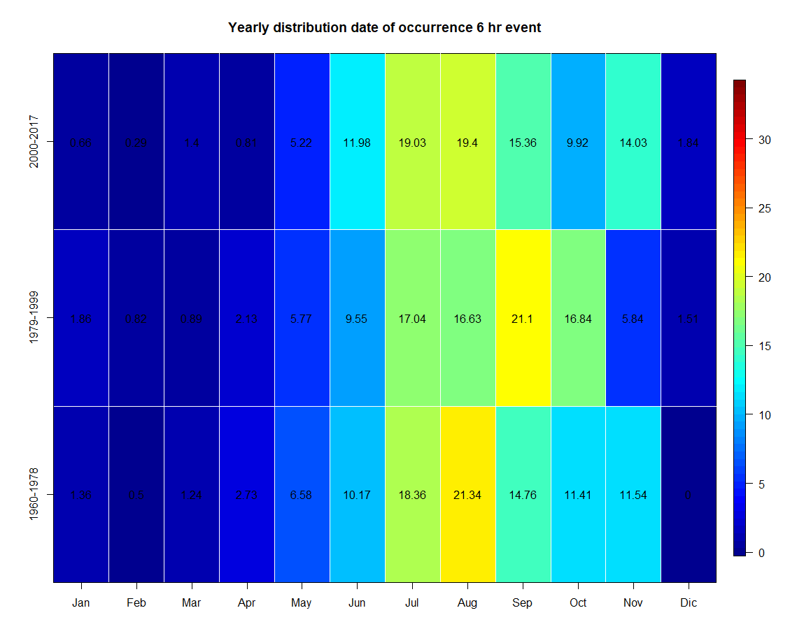

```{r setup, include=FALSE}
knitr::opts_chunk$set(echo = FALSE, cache = TRUE, message = FALSE, comment = NA, dpi = 450)

pkg <- c("Hmisc","leaflet","rgdal","rgeos","sp","sf","raster","Rmisc","gstat","automap","dplyr","knitr",
         "extraDistr","gnFit","data.table","modifiedmk","tmap","extRemes","grid","gridExtra","extrafont",
         "lubridate","reshape2","data.table","janitor","fields","tibble","truncnorm", "EnvStats", "kableExtra", "igraph",
         "nngeo","wesanderson","ggmap","leaflet.extras","tidyr", "tmaptools",
         "tidyverse","rayshader","tseries", "energy", "minerva","gganimate")
dummy = sapply(pkg, function(x){ # for each package check if it is already installed, do so if not, and load it
  if(x %in% rownames(installed.packages()) == FALSE) install.packages(x)
  library(x, character.only = T, quietly = T) # may give some information or warnings, can be ignored usually
})

loadfonts()
nord <- st_read("G:\\Il mio Drive\\Date_CSV\\shp\\Nord.shp")
mk_res <- fread("G:\\Il mio Drive\\Date_CSV\\mk_test_2.csv")
db_all <- read.csv("G:\\Il mio Drive\\Date_CSV\\db_479_stazioni_coord.csv", header = TRUE, sep=";")
colnames(mk_res) <- c("Station","Duration","Corrected Zc","new P-value","N/N*","Original Z","old P.value",
                      "Tau","Sen's slope","old.variance","new.variance")

mk_res <- mk_res %>% mutate(Trend = as.factor(ifelse(`Sen's slope` == 0, "No Trend",
                                 ifelse(`Sen's slope` > 0 & `new P-value` < 0.05,"Significantly Increasing",
                                        ifelse(`Sen's slope` > 0 & `new P-value` > 0.05, "Increasing",
                                               ifelse(`Sen's slope` < 0 & `new P-value` < 0.05, "Significantly Decreasing",
                                                      "Decreasing"))))))
mk_res$Trend <- factor(mk_res$Trend, levels=c("Significantly Increasing","Increasing","Significantly Decreasing","Decreasing","No Trend"))

mk_res$Station <- substr(mk_res$Station,1,nchar(mk_res$Station)-4)  
mk_res<- cbind(mk_res,db_all[match(mk_res$Station,db_all$code),c('lat','lon','elevation','region')])

mk_sf <- st_as_sf(mk_res, coords=c("lon","lat"), crs = 4326)  %>% mutate(Abs.sen=abs(`Sen's slope`))
df_all <- st_read("G:\\Il mio Drive\\Date_CSV\\shp\\trend_update.gpkg")


```

# Agenda
<br><br>  

<ul style="
    position: fixed;
">
<li><p style="font-size:26px;font-weight:350;">Introduction</p>  
</li>
<li><p style="font-size:26px;font-weight:350;">Study area and Data gathering</p>   
</li>
<li><p style="font-size:26px;font-weight:350;">Analysis</p>     

<ul>
<li><p>State of the art </p>
</li>
<li><p>First Results</p>
</li>
<li><p>Preliminary results</p>
</li>
<li><p>Future developments &amp; challenges        </p>
</li>
</ul>
</li>
<li><p style="font-size:26px;font-weight:350;">Conclusions</p> 
</li>
</ul>
---

# Introduction
  
  
Atmospheric temperature strongly influences the intensity of extreme rainfall, as warmer air is capable of holding more water thatn cooler air, thus being able to provide more moisture to rainfall events.  

The __increase in temperature__ is believed to lead to an __intensification of extreme rainfall__ especially for short duration events.  

Even though short-duration storms are the ones impacted the most few studies have been conducted on sub-daily rainfall, globally and in Italy.  

My research focuses on __trend__ detection in __sub-daily__ precipitation extremes

```{r, echo=FALSE, purl=FALSE, out.width="70%", fig.align='center'}

```
  
<p style="line-height:1em;text-align:center;font-size:14px;font-style:italic"> 
Source: <a href="https://data.giss.nasa.gov/gistemp/graphs_v4/">https://data.giss.nasa.gov/gistemp/graphs_v4/</a>
</p>

---

# Study area & Data
  
<br>  
Annual maximum series of 1,3,6,12 and 24 hours for 385 stations  

.pull-left[
__Spatial Availability__  

* Six regions  
* On average 1 station every 290 $km^2$
* Huge gaps in the Po valley 
<br>

  

]  

  
.pull-right[  
__Temporal Availability __   

* Decline starting at the beginning of 90's  
* Problems with continuity in the data
* Period of observation 1960-2017
<br>


]

---

# Study area & Data

After some quality check on the data:


* Length of records of at least 30 years

* NA's less that 25%

* At least 5 years of data for each decade  

148 stations spread across northern Italy with  
<div class="pull-left" style="width: 35%;">
.pull-left[

```{r}
kable(mk_res %>% filter(Duration == 3) %>% group_by(region) %>% dplyr::summarise(n=n()) %>% 
           mutate(density=as.vector((nord %>% slice(-c(3,7)) %>% st_area())/1000^2)/
          (mk_res %>% filter(Duration == 3) %>% group_by(region) %>% dplyr::summarise(n=n()))$n),format = "html",
           digits = 0,col.names = c("Region", "N° Station", "Avg. km^2")) %>% 
  kable_styling(bootstrap_options = c("striped", "hover","bordered")) %>% 
  row_spec(0, background = "indianred")

```


]
</div>  
  


---

# Trend Analysis

There are two main approaches to trend detection and analysis: 

.pull-left[

 __Parametric__    


Fitting of distribution  
<br>
* Pro:   
 + More powerful  
 + Easy to adopt and provide full description of the population  
<br>      
<br>
* Cons: 
 + Need of strong hypothesis on the data:  
        i. Serial independence  
        ii. Normally distributed  
        iii. Require bigger sample size
 + Not capable of handling outliers
<br>

]

.pull-right[
__Non-Parametric__  

Use of test (i.e. Mann-Kendall, Spearmon, ITA)  

* Pro:
  + Handling of non-normal PDFs     
  + Robust with outliers  
<br>
<br>

* Cons:  
 + Require the data to be independent  
 + Are more restrictive   
 + Based on ascending order (loss information)  
]


---

# Trend Analysis
## Visual check

```{r,fig.height=8,fig.width=12}
filename <- list.files("G:\\Il mio Drive\\Date_CSV\\Dati_post_quality_check")

duration <- c("1 Hour","3 Hour","6 Hour","12 Hour","24 Hour")
anni.obs <- array(dim = c(length(seq(1960,2018,1)),length(filename),5),
                  dimnames = list(
                    seq(1960,2018,1),
                    filename,
                    duration
                  ))

for (i in seq_len(length(filename))) {
  
  station <- read.table(paste("G:\\Il mio Drive\\Date_CSV\\Dati_post_quality_check\\",filename[i],sep=""),header=TRUE)
  
  station <- station %>% 
    filter(anno %in% seq(1960,2018,1)) %>% 
    na.omit()

  anni.obs[match(station$anno,rownames(anni.obs)),match(filename[i],colnames(anni.obs)),1] <- station[,2]
  anni.obs[match(station$anno,rownames(anni.obs)),match(filename[i],colnames(anni.obs)),2] <- station[,3]
  anni.obs[match(station$anno,rownames(anni.obs)),match(filename[i],colnames(anni.obs)),3] <- station[,4]
  anni.obs[match(station$anno,rownames(anni.obs)),match(filename[i],colnames(anni.obs)),4] <- station[,5]
  anni.obs[match(station$anno,rownames(anni.obs)),match(filename[i],colnames(anni.obs)),5] <- station[,6]
}
per_1 <- anni.obs %>% melt() %>% na.omit() %>% filter(Var1 < 1988) %>% mutate(Period=1)
per_2 <- anni.obs %>% melt() %>% na.omit() %>% filter(Var1 > 1987) %>% mutate(Period=2)

ggplot(rbind(per_1,per_2),aes(x=Var3,y=value,fill=factor(Period)))+geom_boxplot(size = 0.75, notch = TRUE, width = 0.50)+
  labs(title = "", y = "Rainfall height [mm]",x="")+
  scale_y_continuous(breaks = seq(0,500,125))+
  scale_x_discrete(labels = c("1 Hour","3 Hour","6 Hour","12 Hour","24 Hour"))+
  scale_fill_manual(name="Period",labels=c("1960-1988","1989-2018"),values = c("#f20d1c","#014da4"))+
  theme_bw()+
  theme(strip.text.x = element_text(size = 17, colour = "black", face = "bold.italic"),
        panel.grid.major = element_blank(),
        panel.grid.minor = element_blank(),
        panel.border = element_blank(), panel.background = element_blank(),
        plot.title = element_text(size = 20, family = "Calibri", face = "bold"),
        text=element_text(family="Calibri"),
        axis.title = element_text(face="bold",size = 17),
        axis.text.x=element_text(colour="black", size = 15),
        axis.text.y=element_text(colour="black", size = 15),
        axis.line = element_line(size=0.5, colour = "black"),
        legend.title = element_text(size = 16, family = "Calibri", face = "bold"))


```


---

# Trend Analysis
## MK Test & Sen's slope estimator (Mann, 1945; Kendall, 1975)
<p style="text-align:center;line-height:1em;font-weight:400;"> 
MK is a Non-parametric test used for detection of monotonic linear trend 
</p>  


+ Serially independent

+ Does not require normality assumption 

+ Does not give information about the magnitude of the trend  

+ Allows the assessment of statistically significant trend

<br>  

<p style="text-align:center;line-height:1.5em;font-weight:400;"> 
Sen's slope estimator is a non-parametric procedure aimed at assessing the change per unit time when a linear trend is indeed present. 
</p> 


The linear model $f(t)$:  

\begin{align}
f(t)= Qt + B
\end{align}

and the slope Q is given by:  

\begin{align}
Q_i = median(\frac{x_j - x_i}{j-i})\text{ for all j > i}
\end{align}
<br>

---

# Trend Analysis
## MK Test & Sen's slope estimator (Results)

```{r, fig.height=8,fig.width=12}

# 
# mk_res <- fread("G:\\Il mio Drive\\Date_CSV\\mk_test_2.csv")
# colnames(mk_res) <- c("Station","Duration","Corrected Zc","new P-value","N/N*","Original Z","old P.value",
#                       "Tau","Sen's slope","old.variance","new.variance")
# 
# mk_res <- mk_res %>% mutate(Trend = as.factor(ifelse(`Sen's slope` == 0, "No Trend",
#                                  ifelse(`Sen's slope` > 0 & `new P-value` < 0.05,"Significantly Increasing",
#                                         ifelse(`Sen's slope` > 0 & `new P-value` > 0.05, "Increasing",
#                                                ifelse(`Sen's slope` < 0 & `new P-value` < 0.05, "Significantly Decreasing",
#                                                       "Decreasing"))))))
# mk_res$Trend <- factor(mk_res$Trend, levels=c("Significantly Increasing","Increasing","Significantly Decreasing","Decreasing","No Trend"))

ggplot(mk_res,aes(as.factor(Duration),y = (..count..)/sum(..count..),fill=Trend))+
  geom_bar()+
  geom_text(aes(label=paste(round((..count..)/sum(..count..),4)*500,"%")),stat="count",position=position_stack(0.5),
            size = 7)+
  labs(title = "Percentage distribution of trends", y = "Percentage %",x="")+
  scale_y_continuous(breaks = seq(0,0.2,0.05),labels = c(0,"25%","50%","75%","100%"))+
  scale_x_discrete(labels = c("1 Hour","3 Hour","6 Hour","12 Hour","24 Hour"))+
  scale_fill_manual(values = c("#014da4","#bddcff","#f20d1c","#f4a0a6","grey"))+
  theme_bw()+
  theme(strip.text.x = element_text(size = 17, colour = "black", face = "bold.italic"),
        panel.grid.major = element_blank(),
        panel.grid.minor = element_blank(),
        panel.border = element_blank(), panel.background = element_blank(),
        plot.title = element_text(size = 20, family = "Calibri", face = "bold"),
        text=element_text(family="Calibri"),
        axis.title = element_text(face="bold",size = 17),
        axis.text.x=element_text(colour="black", size = 15),
        axis.text.y=element_text(colour="black", size = 15),
        axis.line = element_line(size=0.5, colour = "black"),
        legend.title = element_text(size = 16, family = "Calibri", face = "bold"),
        legend.text = element_text(size = 10,family = "Calibri"))

```

---

# Trend Analysis
## MK Test & Sen's slope estimator (Results)
```{r, width=12, height=8, fig.align='center'}


```

---

# Trend Analysis
## MK Test & Sen's slope estimator (Results)

<div class="pull-left" style="width:35%;margin-top:2.5%;">
<div class="pull-left" style="width:100%"><table class="table table-striped table-hover table-bordered" style="margin-left: auto; margin-right: auto;">
 <thead>
  <tr>
   <th style="text-align:left;background-color: indianred !important;">   </th>
   <th style="text-align:left;background-color: indianred !important;"> 10% </th>
   <th style="text-align:left;background-color: indianred !important;"> 5% </th>
   <th style="text-align:left;background-color: indianred !important;"> 1% </th>
  </tr>
 </thead>
<tbody>
  <tr>
   <td style="text-align:left;"> +1hr </td>
   <td style="text-align:left;"> 33.11 % </td>
   <td style="text-align:left;"> 25 % </td>
   <td style="text-align:left;"> 13.5 % </td>
  </tr>
  <tr>
   <td style="text-align:left;"> +3hr </td>
   <td style="text-align:left;"> 30.41 % </td>
   <td style="text-align:left;"> 22.3 % </td>
   <td style="text-align:left;"> 13.5 % </td>
  </tr>
  <tr>
   <td style="text-align:left;"> +6hr </td>
   <td style="text-align:left;"> 31.76 % </td>
   <td style="text-align:left;"> 23.65 % </td>
   <td style="text-align:left;"> 11.5 % </td>
  </tr>
  <tr>
   <td style="text-align:left;"> +12hr </td>
   <td style="text-align:left;"> 26.35 % </td>
   <td style="text-align:left;"> 22.3 % </td>
   <td style="text-align:left;"> 10.1 % </td>
  </tr>
  <tr>
   <td style="text-align:left;"> +24hr </td>
   <td style="text-align:left;"> 18.23 % </td>
   <td style="text-align:left;"> 13.5 % </td>
   <td style="text-align:left;"> 6.08 % </td>
  </tr
    <tr>
   <td style="text-align:left;"> -1hr </td>
   <td style="text-align:left;"> 4.74 % </td>
   <td style="text-align:left;"> 2.71 % </td>
   <td style="text-align:left;"> 0.68 % </td>
  </tr>
  <tr>
   <td style="text-align:left;"> -3hr </td>
   <td style="text-align:left;"> 2.03 % </td>
   <td style="text-align:left;"> 0.68 % </td>
   <td style="text-align:left;"> 0.68 % </td>
  </tr>
  <tr>
   <td style="text-align:left;"> -6hr </td>
   <td style="text-align:left;"> 4.06 % </td>
   <td style="text-align:left;"> 2.03 % </td>
   <td style="text-align:left;"> 1.35 % </td>
  </tr>
  <tr>
   <td style="text-align:left;"> -12hr </td>
   <td style="text-align:left;"> 2.03 % </td>
   <td style="text-align:left;"> 0.68 % </td>
   <td style="text-align:left;"> 0 % </td>
  </tr>
  <tr>
   <td style="text-align:left;"> -24hr </td>
   <td style="text-align:left;"> 5.03 % </td>
   <td style="text-align:left;"> 1.35 % </td>
   <td style="text-align:left;"> 0.68 % </td>
  </tr>

</tbody>
</table>


</div>
</div> 
  


---

# Trend Analysis
## Innovative trend analysis (ITA)  (Şen, 2012)
  
* Plot the first half of a time-series vs the second half and plot it against each other on a Cartesian coordinate system.  

* Trend are identified observing the points placing above or below the 1:1 line denoting, respectively, an increasing or a decreasing trend.  

The main __advantages__ of this method resides in:  

.pull-left[

* There is no distinction whether the time series are non-normally distributed, having small sample lengths, or possess serial correlations.  
* The results can be observed graphically  

* Possibility to investigate and visualize sub-trends allowing us to detect non monotonic trends when within the same time series there are increasing and decreasing trends
]

--

.pull-right[

]

---

# Trend Analysis
## Innovative trend analysis (ITA)  (Şen, 2012)
  
    
```{r, fig.height=6,fig.width=10, fig.align='center'}
set.seed(1)
par(mfrow=c(1,2))
example <- runif(100)
plot(example,type="l",ylim=c(-1.2,2), main="Example Time series",xlab="Count of observations",ylab="Value")
example2 <- example + seq(0,1,1/99)
lines(example2,type="l",col="blue")
example3 <- example + rev(seq(-1,0,1/99))
lines(example3,type="l",col="red")

plot(sort(example[1:50]),sort(example[51:100]),xlim=c(-0.5,1.5),ylim=c(-1.2,1.9), main="Example application ITA",
     xlab="First half time-series",ylab="Second half time-series")
abline(a=0,b=1)
points(sort(example2[1:50]),sort(example2[51:100]),col="blue")
points(sort(example3[1:50]),sort(example3[51:100]),col="red")

```


---

# Trend Analysis
## Innovative trend analysis (ITA)  (Şen, 2012)
  
Here 3 examples of time series with increasing (blue), decreasing(red) and with no trend (grey) according to the results of the MK test.  

.pull-left[  

__Time series__  

```{r,dpi=300}
incr   <- read.table(paste("G:\\Il mio Drive\\Date_CSV\\Dati_post_quality_check\\","V008.txt",sep=""),header=TRUE) %>% 
            filter(anno %in% seq(1960,2018,1)) %>% 
            na.omit() %>% dplyr::select(1:2)
decr   <- read.table(paste("G:\\Il mio Drive\\Date_CSV\\Dati_post_quality_check\\","E049.txt",sep=""),header=TRUE) %>% 
            filter(anno %in% seq(1960,2018,1)) %>% 
            na.omit() %>% dplyr::select(1:2)
not_tr <- read.table(paste("G:\\Il mio Drive\\Date_CSV\\Dati_post_quality_check\\","T0074.txt",sep=""),header=TRUE) %>% 
            filter(anno %in% seq(1960,2018,1)) %>% 
            na.omit() %>% dplyr::select(1:2)

par(mfrow=c(3,1),mar=c(4,4,1,1))
plot(incr$anno,incr$X1,type="l",col="#014da4",xlab="Time Period", ylab="Rainfall in mm", cex.lab = 1.25,lwd=1.5)
abline(a = lm(incr$X1~incr$anno)$coefficient[1],b=lm(incr$X1~incr$anno)$coefficient[2],lty=2,col="#014da4")
text(max(incr$anno)-2,max(incr$X1)*.9,paste("Slope = ",round(lm(incr$X1~incr$anno)$coefficient[2],2)),cex=1.25)
rect(xleft = max(incr$anno)-6,ybottom = max(incr$X1)*.85,xright = max(incr$anno)+2,ytop = max(incr$X1)*.95)

plot(decr$anno,decr$X1,type="l",col="#f20d1c",xlab="Time Period", ylab="Rainfall in mm", cex.lab = 1.25,lwd=1.5)
abline(a = lm(decr$X1~decr$anno)$coefficient[1],b=lm(decr$X1~decr$anno)$coefficient[2],lty=2,col="#f20d1c")
text(max(decr$anno)-2,max(decr$X1)*.9,paste("Slope = ",round(lm(decr$X1~decr$anno)$coefficient[2],2)),cex=1.25)
rect(xleft = max(decr$anno)-6,ybottom = max(decr$X1)*.85,xright = max(decr$anno)+2,ytop = max(decr$X1)*.95)

plot(not_tr$anno,not_tr$X1,type="l",col="grey",xlab="Time Period", ylab="Rainfall in mm", cex.lab = 1.25,lwd=1.5)
abline(a = lm(not_tr$X1~not_tr$anno)$coefficient[1],b=lm(not_tr$X1~not_tr$anno)$coefficient[2],lty=2,col="grey")
text(max(not_tr$anno)-2,max(not_tr$X1)*.9,paste("Slope = ",round(lm(not_tr$X1~not_tr$anno)$coefficient[2],2)),cex=1.25)
rect(xleft = max(not_tr$anno)-6,ybottom = max(not_tr$X1)*.85,xright = max(not_tr$anno)+2,ytop = max(not_tr$X1)*.95)
```
]

--

.pull-right[  

__ITA subset of time series__
    
```{r,dpi=300}

#ITA
par(mfrow=c(3,1),mar=c(4,4.5,1,1))
plot(sort(incr$X1[1:ceiling(length(incr$X1)/2)]),sort(incr$X1[ceiling(length(incr$X1)/2):length(incr$X1)]),
     type="p", pch = 19, cex=1.25,col="#014da4",xlab="First Half", ylab="Second Half", cex.lab = 1.5,
     xlim=c(min(incr$X1),max(incr$X1)),ylim=c(min(incr$X1),max(incr$X1)))
abline(a=0,b=1)
plot(sort(decr$X1[1:ceiling(length(decr$X1)/2)]),sort(decr$X1[ceiling(length(decr$X1)/2):length(decr$X1)]),
     type="p", pch = 19, cex=1.25,col="#f20d1c",xlab="First Half", ylab="Second Half", cex.lab = 1.5,
     xlim=c(min(decr$X1),max(decr$X1)),ylim=c(min(decr$X1),max(decr$X1)))
abline(a=0,b=1)
plot(sort(not_tr$X1[1:ceiling(length(not_tr$X1)/2)]),sort(not_tr$X1[ceiling(length(not_tr$X1)/2)+1:length(not_tr$X1)]),
     type="p", pch = 19, cex=1.25,col="grey",xlab="First Half", ylab="Second Half", cex.lab = 1.5,
     xlim=c(min(not_tr$X1),max(not_tr$X1)),ylim=c(min(not_tr$X1),max(not_tr$X1)))
abline(a=0,b=1)


``` 
]

---

# Trend Analysis
## Innovative trend analysis (ITA) Results


---

# Trend Analysis
## Innovative trend analysis (ITA) Results

```{r, echo=FALSE, purl=FALSE, out.width="85%", fig.align='center'}

```


---
# Correlation Analysis
## Relationship between trend and morpological characteristics (Elevation, TWI, Distance from water body)

<br>
<br>


```{r}

tbl_cor  <- array(data = rep(0),dim = c(3,5,1),
                             dimnames = list(
                               c("Cor","Dist. Corr.","MIC"),
                               c("1","3","6","12","24"),
                               c("Elevation")))

k <- 0

for (i in c(1,3,6,12,24)) {
  k = k + i/i
  df <- df_all
  df <- df %>% filter( Duration == i)
  

tbl_cor[1,k,1] <- cor(df$elevation,df$Sen.s.slope)

tbl_cor[2,k,1] <- dcor(df$elevation,df$Sen.s.slope)

tbl_cor[3,k,1] <- mine(df$elevation,df$Sen.s.slope)$MIC

}


kable(round(tbl_cor,2), format = "html",col.names = c("1hr", "3hr","6hr", "12hr", "24hr")) %>% 
  kable_styling(bootstrap_options = c("striped", "hover","bordered"),font_size = 12) %>% 
  row_spec(0, background = "indianred")

```


---
# Work in progress   
## Seasonality 

Date of occurence of every extreme event for each duration.(Only: _Piemonte_ , _Trentino alto Adige_ and _Friuli Venezia Giulia_)  


  

---
# Work in progress   
## Seasonality 


  
---
# Work in progress   
## Seasonality 


  

---
# Work in progress   
## Seasonality 


---
# Work in progress   
## Seasonality 
  
Looking into a window of 20 years  


  

  

---
# Work in progress   
## Seasonality 


  
---
# Work in progress   
## Seasonality 



  

---
# Work in progress   
## Seasonality 


  


---
# Future developments & challenges  
  
<br>  
<br>
<br>
<br>  

__Developments__  

* Further investigation of seasonality analysis expanding to the whole area  
  
  
* Analysis of covariates such as temperature  
  
  
* Entering the parametric world  
  
  
   

__Challenges__  
    
* Data availability  
  
  
* Exploring AI techniques applied to trend detection  
  
  
* Bridge between historical data and forecasting  


